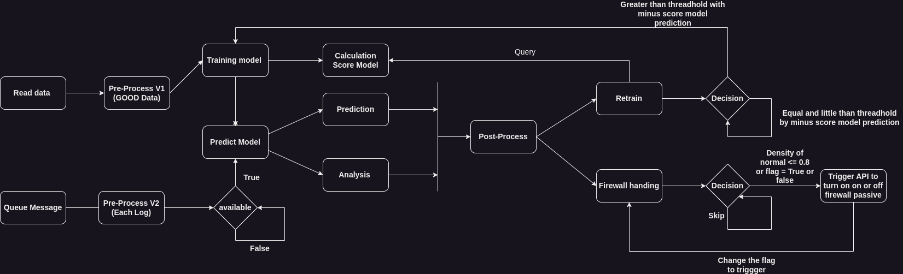

# ML_AI :coffee:

**AI and ML of NTMA in here**

A new version of Model AI For IDS is available
- Model Non Label using LSTM --> [File](./IDS/ModelWithLabel/LSTM.py)
    - That will be base on the existing LSTM implementation, just renew some kind for like stuff work (CCIDS2017-Data and more ...)
    - LSTM implementation in OC model - easier to read and understand
- Model with Label using Kmean --> [File analysis](./IDS/ModelNonLabel/KMEAN.ipynb) and [Kmeans for queue message](./IDS/ModelNonLabel/IDS-Kmeans.py)
    - That module is available in used in python3 but it need env file to connect with prometheus and kafka to trigger queue messages and process analytic and predict anomalies
    - Require for run this model --> Huge resource will be use on init step for model 1-2Gb Rams (Need available) --> After that it will be stable and need resource when retrain model
    - Just queue and wait to detection - Anything damage will be notify for your telegram bot

Design of KMeans IDS for Prediction Anomalies and Handling Firewall Passive
