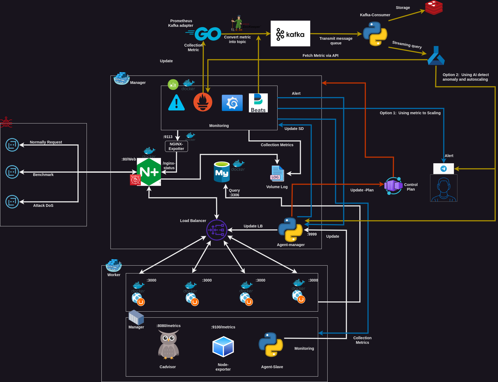
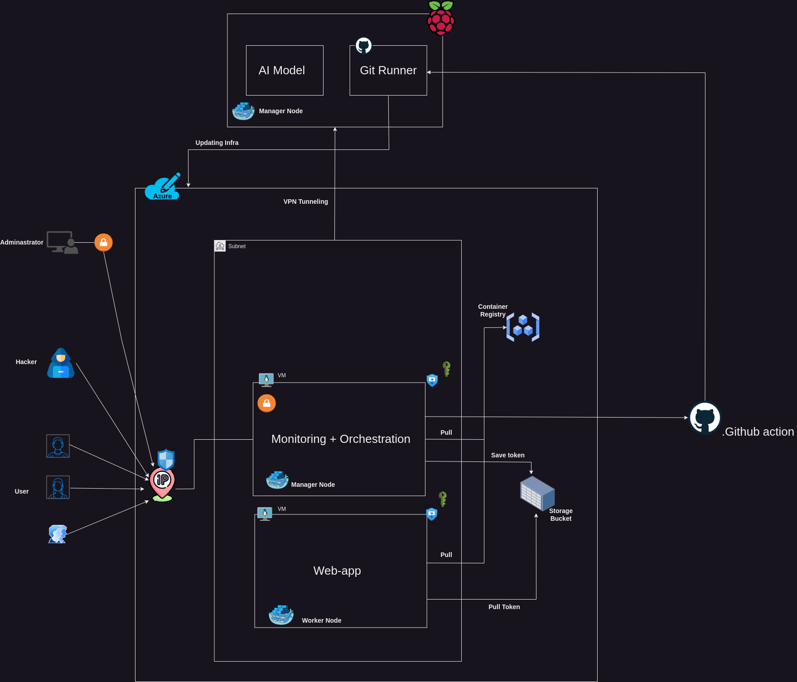

# NTMA_Anomaly
Network Traffic Monitor and Analysis on Anomally for Scale Infra
---

Code structure:  
- [Application]:
    - app: content anything to bringup the TODO app
    - docker-compose.yaml: file to interact with app and install app into container
- [Infrastructure]:
    - backup: backup everything log files **Deprecated Current**
    - design: XML documentation for draw.io to watching the design about infrastructure of system on Local and Cloud
    - docker: container anything related with docker
        - conf: docker image configuration include for Webserver NGINX and Monitoring for Grafana and Prometheus
        - log: contain logs information about the access and error on nginx
        - docker-compose.yaml: compose file for deploy nginx webserver
        - dockerfile.nginx: using for building webserver images
        - monitoring-compose.yaml: compose file for deploy monitoring
- [Script]:
    - bot:
        - demand_bot.py: using to interact with API and doing the benchmark for TODO APP
    - webhook:
        - Hook_Interact_Telegram : Using like webAPI - for listening trigger from module alert --> To Alert Notification for Telegram :coffee:
    - worker:
        - bash: shell script to run anything want setup to node Linux
            - manage-swarm.sh: On progress for development
            - setup-*.sh: shell script for setup one thing do you want base on name on file, Have 4 Option to choice [Create, Destroy, Up and Down] (except: advisor)
        - python:
            - log-process: Processing and convert log file into csv file for --> Data Module - On Progress Development

Design Infrastructure:  
**Local Infra**  
  
**Cloud Infra**  
